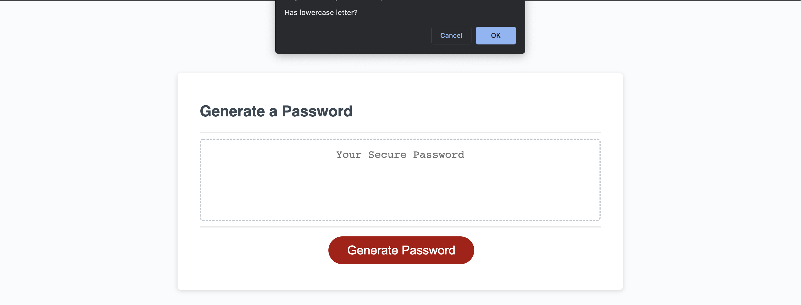

# Password Generator with JavaScript

## Description
[Link to live site](https://leighasteele.github.io/js-password-gen/)

This site was an attempt at making a random password generator with symbols, lowercase letters, and numbers. The user can press the "generate password" button and after selecting the prompts, will be given a random password based on those selections.

## Screenshot
